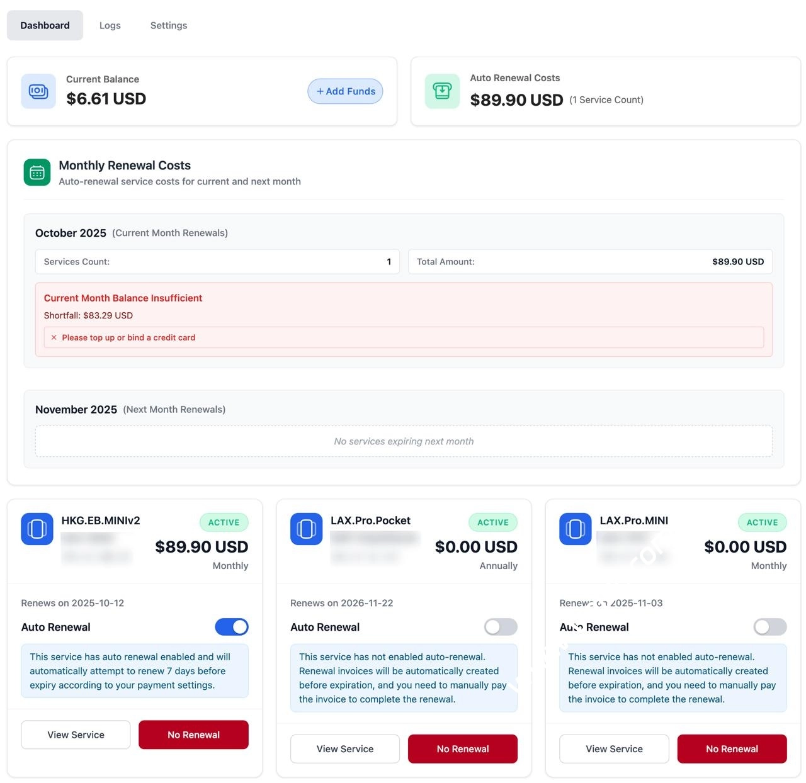

# DMIT 上线 VPS 自动续费功能：账户余额 + 信用卡双重保障，告别手动续费烦恼

---

最近 DMIT 又搞了个挺实用的功能——VPS 自动续费终于来了。不用再担心忘记续费导致服务器突然断了，尤其是那些跑着网站或者业务系统的朋友，这功能简直是救星。

具体怎么玩呢？很简单。登录客户中心，左侧菜单找到"帐务"，里面就有自动续费设置页面。你可以选择用账户余额扣款，也可以绑定信用卡自动扣。默认是关闭的，得手动开启，选好要续费的 VPS 服务就行。现在还在测试阶段，可能会有点小 Bug，遇到问题直接找客服反馈就好。

说到 DMIT，这家主机商在技术圈里口碑一直不错。他们专注做亚洲市场，香港、日本、洛杉矶这些节点的网络线路都很扎实——电信 CN2 GIA、移动 CMIN2、联通 9929 三网优化线路全覆盖，国内访问延迟低，稳定性也高，全年在线率能到 99.99%。👉 [想体验低延迟、高稳定的亚洲优化线路？点这里看看 DMIT 的香港和日本节点](https://www.dmit.io/aff.php?aff=13832)

而且他们控制面板有中文，支付宝、PayPal、信用卡都能用，国内用户买起来没啥门槛。对了，他们还限制单服务器用户数，不会超售，性能比较稳定，适合跑直播、跨境电商、游戏加速这些对网络要求比较高的场景。

---

## 日本 VPS 套餐：三种线路任你选

DMIT 的日本节点有三种套餐，线路不一样，价格也不一样。

**1. 日本 Tier 1 套餐**

这是国际互联线路，没针对国内做优化。电信和联通双程走 NTT，偶尔会绕美国走 Lumen，移动走 CMI。配置上给 1 个 IPv4 和 1 个 IPv6 /64，流量超了不会停机，只是会限速。比如 T1.WEE 套餐超了之后会限制到 50Mbps 不限流量继续用。

测试 IP：`154.31.112.5`

**2. 日本 Premium 套餐 – CN2 GIA 线路**

这套餐就是专门优化过的了。基于 KVM 虚拟化，1Gbps 带宽，线路是 CN2 GIA/10099(9929)/CMI，三网回程都走优化线路。默认 1 个 IPv4 和 1 个 IPv6 /64，流量超了会暂停，得充值才能继续用。

测试 IP：`154.12.190.32`

**3. 日本 Eyeball 常规套餐 – 三网回程 CMIN**

路由是三网 CMI 回程，电信和联通去程走 CTG GIA，移动去程走 CMI。同样是 1 个 IPv4 和 1 个 IPv6 /64，流量超了会暂停。

测试 IP：`154.31.116.3`

---

## 香港 VPS 套餐：稳定低延迟的首选

香港节点一直是很多人的首选，毕竟离国内近，延迟低。DMIT 的香港 VPS 也分三种套餐。

**1. 香港 Tier 1 套餐**

国际互联线路，没针对国内优化。适合对线路要求不高的场景。

测试 IPv4：`154.12.176.28`

**2. HKG.EB 套餐**

回程三网 CMI，电信去程走 CTG GIA，联通去程走 CTG（跨境段是 4837，在香港交换到 23764），移动去程走 CMI。这套餐性价比挺高。

测试 IP：`154.12.188.3`

**3. 香港 Premium CN2 GIA VPS 套餐**

这是香港节点里最好的线路了。KVM 虚拟化，宿主机用 AMD EPYC 处理器，带宽从 100Mbps 到 500Mbps 共享，默认 1 个 IPv4 和 1 个 IPv6。

网络方面：三网回程都是香港 CTG 接国内 CN2 GIA，电信去程走 CN2 GIA 直连香港 CTG，联通香港 4837 + AS10099 直连，移动香港 CMI 直连。这线路质量确实没话说。

测试 IP：`103.117.100.199`

---

## 美国洛杉矶 VPS：价格实惠的备选方案

洛杉矶节点价格比香港和日本便宜一些，适合预算有限但又想要稳定线路的用户。

**1. 洛杉矶 Tier 1 套餐**

国际互联线路，追求国内速度的不建议买这个。适合做国际业务或者备份用。

测试 IPv4：`174.136.204.135`

**2. LAX.EB 常规套餐 – 三网回程 CMIN2**

宿主机用 AMD EPYC 高性能处理器，IPv4 + IPv6 双栈网络。路由方面：
- 电信：AS9929/AS58807 负载均衡
- 联通：AS9929
- 移动：AS58807

这套餐性价比很高，适合大多数国内用户。

**3. LAX.Pro – Premium 套餐**

洛杉矶 CN2 GIA 线路，电信去程 GIA (AS4809)，联通去程直连 AS4837，移动去程香港移动 (AS58453)，三网回程都是 GIA (AS4809)。追求极致速度和稳定性的可以选这个。

---

## 总结：自动续费 + 优质线路，让 VPS 管理更省心

DMIT 这次上线的自动续费功能确实挺贴心，不用再担心忘记续费导致业务中断。再加上他们本身的线路质量和稳定性都不错，👉 [如果你正在找一个低延迟、高稳定、支持自动续费的亚洲优化 VPS，DMIT 值得一试](https://www.dmit.io/aff.php?aff=13832)。香港、日本、洛杉矶三个节点任选,年付价格从 $36.9 起，支持支付宝付款，国内用户用起来没啥门槛。
